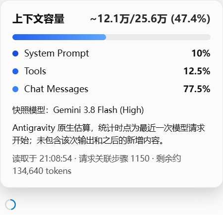

# Antigravity 2.x Context Window Monitor

面向 **Antigravity Standalone GUI** 的本地 CDP 注入挂件。已在 Windows / Antigravity **2.13.0** 真机验证；不是 VSIX，不适用于 IDE 或 CLI。

显示 Antigravity 自身返回的「最近一次模型请求开始时的上下文估算 / 该请求实际上下文上限」，约数使用 `~` 标识。数据未知或接口失败时显示 `—`，不会显示虚假的 0%。



## 启动

需要现有的 **Node.js 22+**，无 npm 依赖，无需 `npm install`。

1. 打开 Antigravity Standalone 并进入会话。
2. 在本目录运行 `npm run check`，确认 `supported`。
3. 运行 `npm start`，保持此终端运行；挂件会自动出现在模型选择器旁。
4. 悬停、点击或使用 Tab 聚焦查看详情，Escape 关闭详情。

Windows 联动启动：双击 `win/antigravity-launch.bat`，自动启动客户端，并在后台同时注入**上下文窗口 + 中文界面**。两项功能共用一个 Node.js 守护、CDP 连接和重连机制；无需 Python、pip 或 npm 安装依赖。请保留完整项目目录，不能只复制 BAT。安装在其他位置时，先设置 `ANTIGRAVITY_EXE` 为实际 exe 的绝对路径；也可设置 `NODE_EXE` 指向 Node.js 22+。

首次从旧版升级时，请完全退出 Antigravity（包括托盘），等待旧守护约 30 秒退出，再双击脚本。重复点击不会叠加守护。启动器不配置开机启动、不修改客户端安装包、不设置代理。

代码按功能分开：

```text
src/
  context/                 上下文解析、挂件及注入源码
  localization/            汉化引擎、词库及注入源码
    dicts/                 common.json、ui_v2.json、phrases.json
  injections.mjs           注入插件注册表与注入执行逻辑
  watch_context_widget.mjs 两项功能共用的 CDP 守护入口
win/
  antigravity-launch.bat   日常唯一启动入口
  start_context_monitor.vbs 隐藏启动共用守护
```

汉化沿用用户提供的 Windows v2.1.0 包中的页面翻译引擎和完整词库，保留动态文案、属性翻译、页面内会话标题处理和内容保护规则；模型选择器及上下文挂件排除翻译，以免改变模型匹配。原包通过本地会话数据库提炼未打开会话标题的功能未接入；保留页面内标题处理。原分享包保持原样，集成运行不依赖它。来源与改动见 [汉化说明](src/localization/README.md)。

Antigravity 2.13.0 本身默认开放随机本地 CDP 端口；监控从 `%APPDATA%\Antigravity\DevToolsActivePort` 发现它。其他 2.x 版本需自行核验，不能据此宣称全版本兼容。

## 命令

| 命令 | 行为 |
| --- | --- |
| `npm start` | 持续发现窗口、注入上下文与汉化、断线重试；Ctrl+C 停止并清理挂件和翻译监听 |
| `npm run check` | 只读诊断版本、挂载点、挂件读数（含 `widget.detail`）及 `localization.installed`，不输出会话内容或凭据 |
| `npm run inject` | 一次注入上下文与汉化；关闭终端后当前页面仍会更新，页面刷新后需重新注入 |
| `npm run remove` | 移除挂件并停止翻译监听；已译文字在页面重载或客户端重启后恢复。须先停止守护，否则会重新注入 |
| `npm test` | 无依赖的核心回归测试 |
| `npm run test:live` | 对打开的已有会话验证重复注入、卸载、原生数值与弹层；结束时保留挂件 |
| `node scripts/live-check.mjs --screenshot` | 同上，并更新仅包含挂件的 `docs/live-widget.png` |

自定义 profile 或端口：

```powershell
node src/watch_context_widget.mjs --profile "D:\AntigravityProfile"
node src/watch_context_widget.mjs --check --port 9333
```

`--port` 只接受本机端口；默认 profile 路径不变。诊断出现 0 个页面时，请从托盘打开主窗口；`unsupported` 表示未识别到 2.x Standalone 页面；`error` 显示 CDP 或注入错误。后台启动故障可先用 `npm start` 查看终端错误。

## 数字含义

数据来自本地只读 RPC：

- `GetAllCascadeTrajectories`：严格按当前窗口 `/c/<id>` 匹配会话，并核对有效步数。
- `GetCascadeTrajectoryGeneratorMetadata`：读取 `chatModel.chatStartMetadata.contextWindowMetadata.estimatedTokensUsed` 和 `maxContextTokens`。
- `GetUserStatus`：仅提取模型标签用于显示与模型切换识别。

**快照不是逐 token 实时计数。** 它不包括该次模型响应输出和之后尚未进入下一次请求的内容；统计时点在弹层中明确说明。活跃会话每 3 秒读取，空闲会话每 15 秒读取，失败后退避至最多 30 秒。切换会话/模型会立即清空旧读数并安排读取。

不累计 input/cache/output，不套用固定 1M 或 IDE 静态阈值表。缺少原生元数据时显示未知。模型切换后，如果最近快照仍属于旧模型，等待新模型的请求，而非把旧分子配新分母；只有正向确认当前选择与快照归属同一模型才显示读数——配置拉不到或映射缺失、快照未标注模型、选择器无文本或选择为别名时同样显示未知，并在可恢复时自动刷新配置重试。

长会话直接使用生成器元数据接口，不依赖前 500 步。回退后排除含有越界步骤的元数据。checkpoint 推进仅提示「可能发生上下文整理」，不会把 token 减少武断地当作压缩。

## 范围与限制

- 本次整合已在 Windows / Antigravity 2.15.1 真机验证 BAT 启动、汉化注入、首页挂件挂载与重复注入不叠加；40 项自动测试通过。2.15.1 的会话上下文数值尚未真机验收，下面的会话数值结论仍对应 2.13.0。
- 真机通过：Windows 2.13.0、Gemini 3.8 Flash (High)、239 步及关联第 1,150 步的会话；本机 7 个模型 77 条会话的原生元数据均按「有则读取、无则未知」解析通过，分母随模型变化（如 160,000 / 128,000 / 256,000）。带 composer 的非 Flash 会话挂件挂载核对、其他 2.x 小版本尚未真机验收。
- 生命周期真机复证：关窗留托盘持续等待不误退、窗口重开约 5 秒重注入、完全退出后约 30 秒守护退出、重启重连与 `remove` 清理均正常。多窗口绑定待有真实多窗口环境验收（2.13.0 未暴露第二窗口入口）。
- 超 500 步已有真实会话核验；回退和 checkpoint 场景仅做合成数据回归，未主动触发用户会话回退。
- 原生接口属于客户端内部接口，升级可能变化。结构不匹配时降级为未知；不承诺永久兼容。
- 仅显示当前窗口的一条明确会话。若同时出现多个可见模型选择器，暂停挂载，避免绑定错误。
- 全量生成器元数据仍可能较大；空闲轮询已降低频率。不会保存对话、提示词、账号资料或 CSRF token，也不会发送到外部服务。
- 持续监控使用本地 29876 端口做单实例锁；占用时会报告并退出。关闭客户端 CDP 后约 30 秒自动退出；仅关窗口但客户端留在托盘时继续等待。
- 静默启动版本需要退出监控进程或完全退出客户端后才能永久移除；不自动结束其他 Node 进程。
- 修改挂件源码、汉化引擎或词库后需重启守护；注入源码在启动时缓存，运行中改文件不会热更新。

## 设计与验收

[详细执行计划](docs/EXECUTION_PLAN.md) · [验证记录](docs/VALIDATION.md)

`src/context/context_core.mjs` 为可测试的原生数据解析，`src/context/widget_client.js` 为界面与本地读取，`src/localization` 保存汉化源码和词库，`src/watch_context_widget.mjs` 为两项功能共用的 CDP 发现、验证与生命周期管理。代码无打包步骤。

保留原项目 [MIT License](LICENSE)。本实现重新编写原生元数据读取逻辑，没有复制 AGI 的 IDE 算法代码；参考仓库及核验结论见执行计划。
